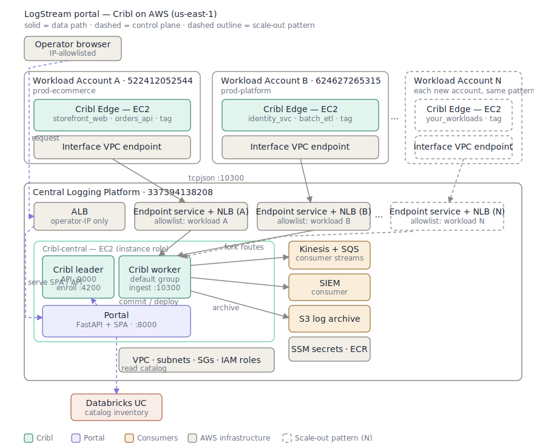

# LogStream Portal

Self-service log onboarding for a **Cribl Stream** pipeline spanning three AWS
accounts. Browse the Unity Catalog inventory of collected log sources, fork the
ones you want into your own Kinesis stream or SQS queue, and manage that fan-out
over time. Sensitive sources require platform-admin approval.

The catalog is read live from a real **Databricks Unity Catalog** workspace (with
a bundled snapshot fallback). The pipeline and consumer streams run on **real
AWS** — two workload accounts generate and tag logs, a logging account hosts the
Cribl control plane, the fork point, the consumer streams, and the portal. The
workload accounts reach the logging account only through **per-account
PrivateLink**, so isolation is enforced at the network layer.

## Topology



```
 Workload Account A (prod-ecommerce)   Workload Account B (prod-platform)
  EC2: Cribl Edge collector             EC2: Cribl Edge collector
   datagen + account tagging             datagen + account tagging
        │ tcpjson                              │ tcpjson
        └──── interface VPC endpoint ──┐ ┌─────┘
                                       ▼ ▼
 Central Logging Platform
   endpoint services + NLBs  →  Cribl leader + worker (default group)
                                  ├─ portal-managed fork routes → Kinesis / SQS / SIEM
                                  └─ archive route → S3
   portal (FastAPI + React SPA) ── leader REST API (commit/deploy) ──┘
        └──► Databricks Unity Catalog (read-only inventory)
```

### How a fork works

A fork is realized as a Cribl **Route** (filter on `account_id` + `workload` +
`source_name`) plus a **Destination** (Kinesis or SQS), created on the leader's
`default` worker group via its REST API, then committed and deployed. The whole
fork set is regenerated from portal DB state on every change.

Each fork also mints a dedicated **cross-account read role** in the logging
account. The role lives under path `/logstream/`, trusts only the consuming
account (the persona's `account_scope`), and its inline `read-access` policy is
scoped to the exact stream/queue ARN — so one stream's role can never read
another stream.

### Consuming your stream

Forked data lands in a stream/queue that lives in the **logging** account, but
the read role trusts your **own** account. To pull events:

1. On **My Streams**, click **Download access** for a live stream. The bundle
   (`<stream>-access.json`) contains the read role ARN, the trust + permission
   policies, and ready-to-run `assume-role` / read CLI snippets.
2. From a shell authenticated as the **consuming account** (the account the
   stream is scoped to — Workload Account A for `dana`, B for `raj`), run the
   `assume-role` snippet to get temporary credentials, export them, then run the
   `read` snippet:

   ```bash
   CREDS=$(aws sts assume-role \
     --role-arn "$(jq -r .role_arn <stream>-access.json)" \
     --role-session-name read-mystream --query Credentials --output json)
   export AWS_ACCESS_KEY_ID=$(echo "$CREDS" | jq -r .AccessKeyId)
   export AWS_SECRET_ACCESS_KEY=$(echo "$CREDS" | jq -r .SecretAccessKey)
   export AWS_SESSION_TOKEN=$(echo "$CREDS" | jq -r .SessionToken)
   # then the bundle's `usage.read` command (Kinesis get-records / SQS receive-message)
   ```

   The assumed role can read **only** that one stream — any other stream returns
   `AccessDenied`.

> **Note — SQS reads are destructive by design.** The SQS read snippet uses
> `receive-message`, which makes a message invisible (and, once its visibility
> timeout lapses without a delete, redeliverable). There is no non-destructive
> "peek" at the AWS layer for SQS; use the portal's **Peek** button for a
> read-only sample instead.

> **Personas are account-scoped.** `dana@app-team` only sees and forks Workload
> Account A sources, `raj@data-sci` only Workload Account B, and `admin@platform`
> sees every account. A consumer attempting to fork a source outside their scope
> gets `403`.

## Prerequisites

- AWS CLI with three profiles (`default` = logging account, plus one per
  workload account), Terraform ≥ 1.6, Docker, and the SSM Session Manager plugin.
- A Databricks workspace; put its creds in `.env` (`DATABRICKS_HOST`,
  `DATABRICKS_TOKEN`, `DATABRICKS_WAREHOUSE_ID`).
- `infra/terraform.tfvars` with `operator_cidr` (your `/32`) and the Databricks
  values; pass secrets (`databricks_token`, `cribl_password`, `session_secret`)
  via `TF_VAR_*` env or the gitignored tfvars.

## Bring it up

    cp .env.example .env                 # add real Databricks creds
    make seed-uc                         # one-time: seed the UC inventory
    cd infra && terraform apply \
      -target=aws_ecr_repository.portal  # create ECR first
    cd .. && make build-push             # build + push the portal image
    make infra-up                        # apply the full 3-account stack
    make seed-cribl                      # seed logging tier + edge collectors
    open "$(cd infra && terraform output -raw portal_url)"

Log in as `dana@app-team` / `raj@data-sci` (consumers) or `admin@platform`
(approves sensitive-source requests). The portal ALB is restricted to
`operator_cidr`.

**Seeding details and the Cribl deployment specifics** (the leader+worker
topology, `tcpjson` forwarding, Edge routes, datagen samples, destination
compression, and the Cribl REST API shapes) are in
[`cribl/README.md`](cribl/README.md).

## Unity Catalog inventory

`make seed-uc` creates catalog `logging_demo` with one schema per workload —
`acct_b__storefront_web`, `acct_b__orders_api`, `acct_c__identity_svc`,
`acct_c__batch_etl` — and one table per log source, carrying sensitivity and
routing metadata (including the real `account_id`) in TBLPROPERTIES.
`fixtures/catalog_snapshot.json` mirrors this inventory and serves as the
offline fallback — keep them in sync.

## Tests

    make test       # backend pytest + frontend vitest (no AWS required)

## Tear down

The portal's data tier (a dedicated EBS volume holding the SQLite stream
registry) has `prevent_destroy`, so a bare `terraform destroy` aborts. Two
make targets handle it:

    make infra-down       # destroy everything BUT the data volume (kept, intact)
    make infra-down-all   # destroy everything; snapshots the volume first

`infra-down` prints the `terraform import` line to run before the next
`make infra-up` (so it reattaches the kept volume instead of creating an empty
one). `infra-down-all` takes an EBS snapshot before deleting, so even the full
nuke is recoverable (`--no-snapshot` to skip). Run either from the directory
whose `infra/` holds the live Terraform state.

## Architecture

See `docs/superpowers/specs/2026-06-12-cribl-aws-portal-design.md` for the
approved design and decision log.
